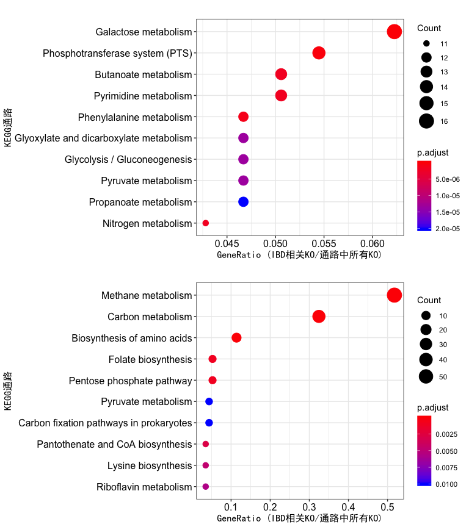
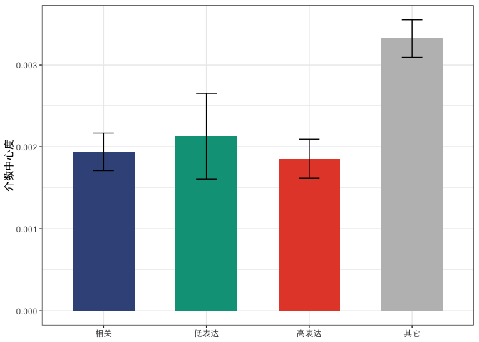
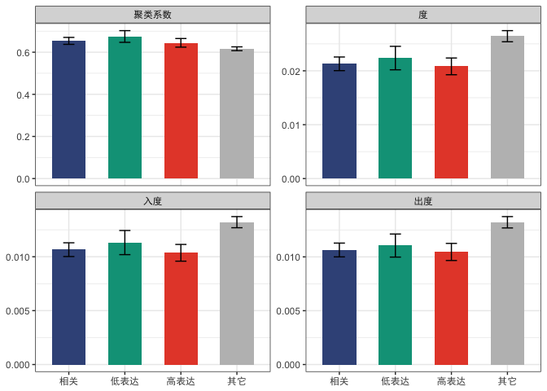
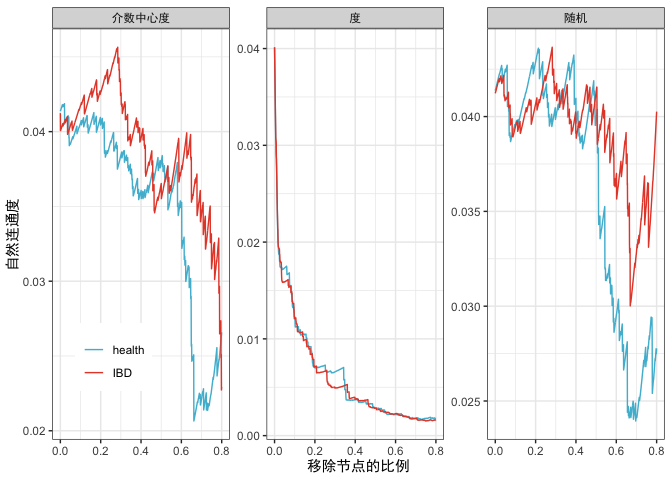

IBD肠道微生物整合代谢网络
================

``` r
library(curatedMetagenomicData)
library(tidyverse)

library(readxl)
library(clusterProfiler)
library(igraph)
library(mmnet)
library(furrr)
library(patchwork)

# 图片中文字体
library(extrafont)
loadfonts()
```

``` r
source_files <- list.files("R", "R$", full.names = TRUE)
for (file in source_files) source(file)
```

## 数据预处理

数据源自Nielsen等人的文章\[1\]，用R包[curatedMetagenomicData](https://github.com/waldronlab/curatedMetagenomicData)获取功能注释数据。我们选择spanish样本进行分析，去除不一致样本，包括肥胖（BMI
\>= 30)、同一个样本中第二次测序的数据、使用发酵乳产品 。

``` r
# 从nielsen文章中下载样本元数据nielsen_sample.xls
samples <- read_xls("data/nielsen_sample.xls")
spanish_sample <- filter(samples, Nationality == "spanish") %>% 
  arrange(`Sample ID`)
# 78 samples were sequenced twice, delete the sequence samples sequenced in the second time
individual <- unique(spanish_sample$`Individual ID`)
indx <- match(spanish_sample$`Individual ID`, individual)
selected_sample <- slice(spanish_sample, which(!duplicated(indx)))
selected_sample <- mutate(
  selected_sample, 
  `Sample ID` = str_replace_all(`Sample ID`, "\\.", "_")
)
# All samples did't consumed a defined fermented milk product containing the 
# previously sequenced Bifidobacterium animalis subsp. lactis CNCM I-2494
# all(selected_sample$`Known consumers of a defined fermented milk product (DFMP)` == "NA")
selected_sample$`Known consumers of a defined fermented milk product (DFMP)` <- NULL
# remove the sample with no bmi, and obese (BMI >= 30)
selected_sample <- filter(selected_sample, BMI != "NA" & BMI < 30)
```

用[curatedMetagenomicData](https://github.com/waldronlab/curatedMetagenomicData)下载功能注释数据

``` r
# set ExperimentHub cache dir
setExperimentHubOption("CACHE", "~/ExperimentHub/")
nile_ds <- curatedMetagenomicData(
  "NielsenHB_2014.genefamilies_relab.stool",
  counts = TRUE,
  dryrun = FALSE
)
```

    ## Working on NielsenHB_2014.genefamilies_relab.stool

    ## snapshotDate(): 2019-04-29

    ## see ?curatedMetagenomicData and browseVignettes('curatedMetagenomicData') for documentation

    ## downloading 0 resources

    ## loading from cache 
    ##     'EH1287 : 1287'

``` r
nile_ds <- nile_ds[[1]]
# subset the functional profilling according to the sample id
sample_ids <- selected_sample$`Sample ID`
sample_indx <- match(sampleNames(nile_ds), sample_ids)
selected_ds <- nile_ds[, !is.na(sample_indx)]
features <- featureNames(selected_ds)
gene_family_abundance <- exprs(selected_ds)
sample_meta <- pData(selected_ds)
```

[curatedMetagenomicData](https://github.com/waldronlab/curatedMetagenomicData)默认使用[humann2](https://bitbucket.org/biobakery/humann2/src/default/humann2/)参考Uniref90进行功能注释，我们使用humann2将其映射至KEGG
orthology。

``` r
humann2_regroup_in <- as.data.frame(
  gene_family_abundance, 
  row.names = row.names(gene_family_abundance)
) %>% 
  rownames_to_column(var = "# Gene Family")

# save as humann2_regoup.py input
# write.table(humann2_regroup_in, "output/data/humann2_regroup_in.tsv", 
#   sep = "\t", quote = FALSE, row.names = FALSE
# )
# regoup using humann2
# humann2_regroup_table --input humann2_regroup_in.tsv \
# --output humann2_regoup_out.tsv --groups uniref90_ko

humann2_regroup_out <- read_tsv("output/data/humann2_regroup_out.tsv") %>% 
  slice(-1)
```

    ## Parsed with column specification:
    ## cols(
    ##   .default = col_double(),
    ##   `# Gene Family` = col_character()
    ## )

    ## See spec(...) for full column specifications.

``` r
index_remove <- select(humann2_regroup_out, -`# Gene Family`) %>% 
  rowSums(.) > 0
humann2_regroup_out <- slice(humann2_regroup_out, which(index_remove)) %>% 
  column_to_rownames("# Gene Family")
```

KO丰度的归一化，为了保证结果的可靠性，丰度在2以下的KO设为0。

``` r
# remove low confidence (abundance) kos， set to 0 while lower than 2, low prevelance
kos_table <- humann2_regroup_out
kos_table[kos_table < 2] = 0
kos_table <- kos_table[rowSums(kos_table) > 0, ]
kos_norm <- sweep(kos_table, 2, sample_meta$number_reads * 100, "/")
state <- sample_meta$disease
```

KO相对丰度在127个样本之间是一致的（平均相关系数为0.83,
Spearman相关检验），健康样本间的KO相对丰度的一致性（平均相关系数0.86，Spearman相关检验）高于IBD样本间的一致性（平均相关系数为0.81，Spearman相关检验）

``` r
# ko correaltion across samples
load("data/sysdata.rda") # reference metabolic network based on KEGG metabolic pathway from mmnet
refnet <- RefDbcache$network
refnode <- V(refnet)$name
ann_kos_table <- kos_norm[row.names(kos_norm) %in% refnode, ]
sample_cor <- cor(ann_kos_table, method = "spearman")
ibd_cor <- sample_cor[state == "IBD", state == "IBD"]
ibd_cor[lower.tri(ibd_cor)] %>% mean()
```

    ## [1] 0.8116212

``` r
health_cor <- sample_cor[state != "IBD", state != "IBD"]
health_cor[lower.tri(health_cor)] %>% mean()
```

    ## [1] 0.8547604

``` r
inter_cor <- sample_cor[state != "IBD", state == "IBD"]
mean(inter_cor)
```

    ## [1] 0.8284058

## 整合代谢网络

我们参考[mmnet](https://github.com/yiluheihei/mmnet)构建整合代谢网络。节点表示KO，如果a
KO参与的代谢反应的产物可作为 b KO
参与代谢反应的底物，那么存在由a到b的连边。

``` r
# load("data/sysdata.rda") # reference metabolic network based on KEGG metabolic pathway from mmnet
# refnet <- RefDbcache$network
# refnode <- V(refnet)$name
subnodes <- intersect(refnode, row.names(kos_norm))

# construct integrated metabolic network
biom.data <- mmnet:::make_biom(kos_norm, observation_metadata = row.names(kos_norm))
biom.data$type <- "enzymatic genes abundance"
ssns <- constructSSN(biom.data)
diff_ssn <- diff_net(ssns, sample.state = state)
```

## 根据比值比OR预测IBD相关KO

OR\>2表示KO在IBD中显著富集，OR\<0.5表示KO在IBD中显著减少。共发现366个IBD相关KO，其中254个高表达，112个低表达

``` r
or <- vertex_attr(diff_ssn, "OR")
or_p <- vertex_attr(diff_ssn, "OR_p")
enrich_indx <- which(or > 2 & or_p < 0.05) 
deplete_indx <-which(or < 0.5 & or_p < 0.05) 
enrich_ko <- V(diff_ssn)$name[enrich_indx]
deplete_ko <- V(diff_ssn)$name[deplete_indx]
```

差异KO进行KEGG代谢通路富集分析

``` r
enrich_pathway <- enrichKEGG(gene = enrich_ko, organism = 'ko', pvalueCutoff = 0.05, qvalueCutoff = 0.05, 
  pAdjustMethod = "fdr")
deplete_pathway <- enrichKEGG(gene = deplete_ko, organism = "ko", pvalueCutoff = 0.05, qvalueCutoff = 0.05, pAdjustMethod = "fdr")
# remove low confidence pathway
enrich_pathway@result <- dplyr::filter(enrich_pathway@result, p.adjust < 0.05)
enrich_pathway@result <- dplyr::filter(enrich_pathway@result, Description != "Carbon metabolism") # 高表达和低表达都富集了，应该在低表达的KO中富集
enrich_pathway@result <- dplyr::arrange(enrich_pathway@result, p.adjust)
deplete_pathway@result <- dplyr::filter(deplete_pathway@result, p.adjust < 0.05)
deplete_pathway@result <- dplyr::filter(deplete_pathway@result, Description != "Glycolysis / Gluconeogenesis")

# 中文
# library(showtext)
# showtext_auto()
p_pathway_enrich <- (enrichplot::dotplot(enrich_pathway, showCategory = 10) + 
    labs(x = "GeneRatio (IBD相关KO/通路中所有KO)", y = "KEGG通路") +
    theme(axis.title = element_text(family = "SimHei"))) +
  (enrichplot::dotplot(deplete_pathway, showCategory = 10) +
    labs(x = "GeneRatio (IBD相关KO/通路中所有KO)", y = "KEGG通路") + 
    theme(axis.title = element_text(family = "SimHei"))) +
  plot_layout(ncol = 1)
```

    ## wrong orderBy parameter; set to default `orderBy = "x"`
    ## wrong orderBy parameter; set to default `orderBy = "x"`

``` r
p_pathway_enrich
```



``` r
# ggsave(p_pathway_enrich, filename = "output/pathway_enrich.pdf", width = 8, height = 9)
```

## IBD相关KO与网络拓扑属性的关联

介数中心度表示网络中心性，KO差异值与中心度负相关，IBD相关的KO中心度比其他KO的中心度低。

``` r
bc <- betweenness(diff_ssn, normalized = TRUE)
diff_score <- abs(log2(or))
cor(diff_score, bc, method = "spearman") # -0.1629
```

    ## [1] -0.1750646

``` r
wilcox.test(diff_score, bc) # 2.2e-16
```

    ## 
    ##  Wilcoxon rank sum test with continuity correction
    ## 
    ## data:  diff_score and bc
    ## W = 1404079, p-value < 2.2e-16
    ## alternative hypothesis: true location shift is not equal to 0

``` r
diff_bc <- bc[c(enrich_indx, deplete_indx)]
other_bc <- bc[-c(enrich_indx, deplete_indx)]
wilcox.test(diff_bc, other_bc, alternative = "less") 
```

    ## 
    ##  Wilcoxon rank sum test with continuity correction
    ## 
    ## data:  diff_bc and other_bc
    ## W = 138736, p-value = 2.301e-08
    ## alternative hypothesis: true location shift is less than 0

``` r
topo_tibble <- generate_topos_tibble(diff_ssn)
topo_other <- dplyr::filter(topo_tibble, state %in% c("Enrich", "Deplete")) %>% 
  mutate(state = "Associate")
topo_tibble <- dplyr::bind_rows(topo_tibble, topo_other)

se <- function(x) sd(x)/sqrt(length(x))
summary_topo_tibble <- group_by(topo_tibble, method, state) %>% 
  summarise(
    m_value = mean(value),
    sd_value = sd(value),
    se = se(value)
  )

topo_tibble_bc <- dplyr::filter(topo_tibble, method == "Betweenness centrality")
summary_topo_tibble_bc <- dplyr::filter(summary_topo_tibble, method == "Betweenness centrality")

p_centrality <- ggplot(summary_topo_tibble_bc, aes(state, m_value, fill = state)) +
  geom_col(width = 0.6) +
  geom_errorbar(aes(ymin = m_value - se, ymax = m_value + se), width = 0.2) +
  labs(x=NULL, y = "介数中心度") + 
  ggsci::scale_fill_npg() +
  scale_x_discrete(
    breaks = c("Associate", "Deplete", "Enrich", "Other"),
    labels = c("相关", "低表达", "高表达", "其它")
  ) +
  theme_bw() +
  theme(legend.position = "none", 
    axis.title = element_text(family = "SimHei"),
    axis.text.x = element_text(family = "SimHei"))
p_color <- ggplot_build(p_centrality)$data[[1]]$fill
p_centrality <- p_centrality + 
  scale_fill_manual(values = c("#3C5488FF", "#00A087FF", "#E64B35FF", "grey")) 
```

    ## Scale for 'fill' is already present. Adding another scale for 'fill',
    ## which will replace the existing scale.

``` r
p_centrality
```

<!-- -->

``` r
# ggsave(p_centrality, filename = "output/figure/fig3.pdf", width = 4, height = 3)
# embed_fonts("output/figure/fig3.pdf")
```

与介数中心度类似，IBD相关KO的度显著小于其KO的度；相反，IBD相关KO的聚类系数显著高于其他KO的聚类系数

``` r
cc <- transitivity(diff_ssn, type ="weighted", vids = V(diff_ssn), isolates=c("zero"))
diff_cc <- cc[c(enrich_indx, deplete_indx)]
other_cc <- cc[-c(enrich_indx, deplete_indx)]
wilcox.test(diff_cc, other_cc, alternative = "greater") # < 0.0003
```

    ## 
    ##  Wilcoxon rank sum test with continuity correction
    ## 
    ## data:  diff_cc and other_cc
    ## W = 192457, p-value = 0.0003798
    ## alternative hypothesis: true location shift is greater than 0

``` r
dg <- degree(diff_ssn, mode = "all", normalized = TRUE)
diff_dg <- dg[c(enrich_indx, deplete_indx)]
other_dg <- dg[-c(enrich_indx, deplete_indx)]
wilcox.test(diff_dg, other_dg, alternative = "less")
```

    ## 
    ##  Wilcoxon rank sum test with continuity correction
    ## 
    ## data:  diff_dg and other_dg
    ## W = 152004, p-value = 0.0005326
    ## alternative hypothesis: true location shift is less than 0

``` r
summary_other_topo <- dplyr::filter(summary_topo_tibble, method != "Betweenness centrality")
summary_other_topo$method <- factor(
  rep(c("聚类系数", "度", "入度", "出度"), each = 4),
  levels = c("聚类系数", "度", "入度", "出度")
)
p_other_topo <- ggplot(summary_other_topo, aes(state, m_value, fill = state)) + 
  geom_col(width = 0.6) +
  geom_errorbar(aes(ymin = m_value - se, ymax = m_value + se), width = 0.2) +
  facet_wrap(~method, scales = "free_y") +
  labs(x=NULL, y = NULL) + 
  ggsci::scale_fill_npg() +
  scale_x_discrete(
    breaks = c("Associate", "Deplete", "Enrich", "Other"),
    labels = c("相关", "低表达", "高表达", "其它")
  ) +
  theme_bw() +
  theme(legend.position = "none", 
    axis.title = element_text(family = "SimHei"),
    axis.text.x = element_text(family = "SimHei"),
    strip.text = element_text(family = "SimHei")
  )
p_other_topo <- p_other_topo +
  scale_fill_manual(values = c("#3C5488FF", "#00A087FF", "#E64B35FF", "grey"))
```

    ## Scale for 'fill' is already present. Adding another scale for 'fill',
    ## which will replace the existing scale.

``` r
p_other_topo
```

<!-- -->

``` r
# ggsave(p_other_topo, filename = "output/figure/fig4.pdf", width = 8, height = 6)
#embed_fonts("output/figure/fig4.pdf")
```

## IBD和healthy网络比较

把所有样本分成IBD和healthy两组，分别构建整合代谢网络，比较其拓扑变化。

``` r
ibd_indx <- state == "IBD"
ibd_table <- kos_norm[, state == "IBD"]
ibd_table <- ibd_table[rowSums(ibd_table) > 0, ]
health_table <- kos_norm[, state != "IBD"]
health_table <- health_table[rowSums(health_table) > 0, ]

ibd_kos <- intersect(refnode, row.names(ibd_table))
health_kos <- intersect(refnode, row.names(health_table))
health_net <- induced_subgraph(refnet, health_kos) 
ibd_net <- induced_subgraph(refnet, ibd_kos) 
```

IBD减少网络的模块性和密度，可能是由于IBD引起肠道微生物多样性和功能减少引起的。随机打乱样本标签（IBD或者healthy）1000次，得到1000对网络作为零分布用于计算网络模块和密度差异是否显著。我们发现真正的healthy-network比零分布中大多数health-network的模块性强（87.5%），而真正的IBD-network比零分布中大多数IBD-network模块性弱（76.6%），同时healthy-network与IBD-network之间的模块化程度差异显著。

``` r
ibd_modularity <- cluster_leading_eigen(as.undirected(ibd_net)) %>% 
  modularity()
health_modularity <- cluster_leading_eigen(as.undirected(health_net)) %>% 
  modularity()
diff_modularity <- health_modularity - ibd_modularity

# modularity shuffled 1000 times
shuffled_modularity <- map(1:1000, ~ shuffle_modularity(kos_norm, state, refnet) %>% unlist()) %>% 
  do.call(rbind, .) %>% 
  as.data.frame()

shuffled_diff_modularity <- shuffled_modularity$health_modularity - shuffled_modularity$disease_modularity
sum(health_modularity > shuffled_modularity$health_modularity) 
```

    ## [1] 748

``` r
sum(ibd_modularity < shuffled_modularity$disease_modularity) 
```

    ## [1] 957

``` r
sum(diff_modularity > shuffled_diff_modularity)
```

    ## [1] 917

``` r
## density
health_density <- edge_density(health_net)
ibd_density <- edge_density(ibd_net)
shuffled_density <- purrr::rerun(1000, shuffle_density(kos_norm, state, refnet) %>% unlist()) %>% 
  do.call(rbind, .) %>% 
  as.data.frame()
diff_density <- health_density - ibd_density
shuffled_diff_density <- shuffled_density$health_density - shuffled_density$disease_density
sum(health_density > shuffled_density$health_density)
```

    ## [1] 906

``` r
sum(ibd_density < shuffled_density$disease_density)
```

    ## [1] 745

``` r
sum(diff_density > shuffled_diff_density)
```

    ## [1] 892

用移除网络中的节点模拟外界环境对代谢网络的扰动，分别按三种顺序移除节点：介数中心度、度和随机。通过比较发现，healthy-network比IBD-network更稳定，无论用何种方法移除节点，需要注意的是，随着移除节点数的增多，按介数中心度（约50%）和随机移除节点（约70%），IBD-network比healthy-network更稳健。

``` r
nc_health_degree <- nc_attack(as.undirected(health_net),method = "degree")
nc_ibd_degree <- nc_attack(as.undirected(ibd_net),method = "degree")
nc_health_bc <- nc_attack(as.undirected(health_net), method = "betweenness")
nc_ibd_bc <- nc_attack(as.undirected(ibd_net), method = "betweenness")
nc_health_random <- nc_attack(as.undirected(health_net), method = "random")
nc_ibd_random <- nc_attack(as.undirected(ibd_net), method = "random")

nc_tibble <- bind_rows(
  make_nc_tibble(unlist(nc_health_degree), "health", "degree"),
  make_nc_tibble(unlist(nc_ibd_degree), "IBD", "degree"),
  make_nc_tibble(unlist(nc_health_bc), "health", "betweenness"),
  make_nc_tibble(unlist(nc_ibd_bc), "IBD", "betweenness")
  , make_nc_tibble(unlist(nc_health_random), "health", "random"),
   make_nc_tibble(unlist(nc_ibd_random), "IBD", "random")
)
nc_tibble_mod <- nc_tibble %>%
  mutate(method = recode_factor(method,
    "betweenness" = "介数中心度",
    "degree" = "度",
    "random" = "随机"
))
p_nc <- ggplot(nc_tibble_mod, aes(x, y, color = state)) +
  geom_line() +
  labs(x = "移除节点的比例", y = "自然连通度") +
  facet_wrap(~method, scales = "free_y") +
  # ggsci::scale_color_npg() +
  scale_color_manual(values = c("#4DBBD5FF", "#E64B35FF")) +
  theme_bw() +
  theme(legend.position = c(0.1, 0.2), 
    legend.title = element_blank(),
    strip.text = element_text(family = "SimHei"),
    axis.title = element_text(family = "SimHei")
  )
p_nc
```

<!-- -->

``` r
ggsave(p_nc, filename = "output/figure/fig5.pdf",
  width = 7, height = 4)
embed_fonts("output/figure/fig5.pdf")


# facet添加tags
# library(gtable)
# tag_facet <- function (p, 
#   open = c("(", ""), close = c(")", "."), 
#   tag_fun_top = function(i) letters[i], 
#   tag_fun_right = utils::as.roman, 
#   x = c(0, 0), y = c(0.5, 1), 
#   hjust = c(0, 0), vjust = c(0.5, 1), 
#   fontface = c(2, 2), family = "", file, ...) 
# {
#   gb <- ggplot_build(p)
#   lay <- gb$layout$layout
#   tags_top <- paste0(open[1], tag_fun_top(unique(lay$COL)), 
#     close[1])
#   tags_right <- paste0(open[2], tag_fun_right(unique(lay$ROW)), 
#     close[2])
#   tl <- lapply(tags_top, grid::textGrob, x = x[1], y = y[1], 
#     hjust = hjust[1], vjust = vjust[1], gp = grid::gpar(fontface = fontface[1], 
#       fontfamily = family, ...))
#   rl <- lapply(tags_right, grid::textGrob, x = x[2], y = y[2], 
#     hjust = hjust[2], vjust = vjust[2], gp = grid::gpar(fontface = fontface[2], 
#       fontfamily = family, ...))
#   g <- ggplot_gtable(gb)
#   g <- gtable::gtable_add_rows(g, grid::unit(1, "line"), pos = 0)
#   l <- unique(g$layout[grepl("panel", g$layout$name), "l"])
#   g <- gtable::gtable_add_grob(g, grobs = tl, t = 1, l = l)
#   wm <- do.call(grid::unit.pmax, lapply(rl, grid::grobWidth))
#   g <- gtable::gtable_add_cols(g, wm, pos = max(l))
#   t <- unique(g$layout[grepl("panel", g$layout$name), "t"])
#   g <- gtable::gtable_add_grob(g, grobs = rl, t = t, l = max(l) + 
#       1)
#   g <- gtable::gtable_add_cols(g, unit(2, "mm"), pos = max(l))
#   # save plot
#   if (file) {
#     pdf(file = file, family="SimHei", width = 7, height = 4)
#     grid::grid.newpage()
#     grid::grid.draw(g)
#     dev.off()
#     embed_fonts(file)
#   }
#   invisible(g)
# }
# 
# 
# p_nc <- ggplot(nc_tibble_mod, aes(x, y, color = state)) +
#   geom_line() +
#   labs(x = "移除节点的比例", y = "自然连通度") +
#   facet_wrap(~method, scales = "free_y") +
#   # ggsci::scale_color_npg() +
#   scale_color_manual(values = c("#4DBBD5FF", "#E64B35FF")) +
#   theme_bw() +
#   theme(legend.position = c(0.1, 0.15), 
#     legend.title = element_blank(),
#     strip.text = element_text(family = "SimHei"),
#     axis.title = element_text(family = "SimHei")
#   )
# 
# tag_facet(
#   p_nc, open = NULL, close = NULL, 
#   fontface = 1,
#   tag_fun_top = function(i)toupper(letters[i]),
#   tag_fun_right = function(x)return(""),
#   file = "Project/IBD-metablic-network/fig5.pdf"
# ) 
```

## 其他

### modularity的p值

除了随机打乱样本label之外，我们还可以随机打乱网络的边（保持每个节点的出入度）1000次，然后裁剪到1000对网络作为零分布

``` r
shuffled_edge_modularity <- map(1:100,
  ~ shuffle_edge_modularity2(diff_ssn, health_kos, ibd_kos) %>% unlist()) %>%
  do.call(rbind, .) %>%
  as.data.frame()
shuffled_edge_modularity <- map(1:100,
  ~ shuffle_edge_modularity(health_net, ibd_net) %>% unlist()) %>%
  do.call(rbind, .) %>%
  as.data.frame()
shuffled_diff_edge_modularity <- shuffled_edge_modularity$health_modularity -
  shuffled_edge_modularity$disease_modularity
sum(diff_modularity > shuffled_diff_edge_modularity)
sum(health_modularity > shuffled_edge_modularity$health_modularity)
sum(ibd_modularity > shuffled_edge_modularity$disease_modularity)
```

### 其他拓扑属性的关联和比较

如度分布，seed set，参考[RevEcoR](https://github.com/yiluheihei/RevEcoR)

``` r
health_net_dd <- degree_distribution(health_net, mode = "all")
ibd_net_dd <- degree_distribution(ibd_net, cumulative = FALSE)
n_health_dd <- length(health_net_dd)
n_ibd_dd <- length(ibd_net_dd)
dd_tibble <- tibble(
  x = c(0:(n_health_dd - 1), 0:(n_ibd_dd - 1)),
  y = c(health_net_dd, ibd_net_dd),
  state = rep(c("health", "IBD"), c(n_health_dd, n_ibd_dd))
)
```

### 另外我们可以对拓扑属性（模块度和密度等）做稀疏分析

比如我们发现IBD模块度较小，我们可以不断增大随机抽取样本数，计算这些拓扑属性，看它们是否趋于稳定（收敛），因为我们的例子中样本数较小（127:IBD
73,健康54），增大样本数目的稀疏曲线不够好。可以不断增加随机抽取序列数进行稀疏分析（因为我们直接利用别人的功能注释数据进行分析，就没有进行这一步尝试）。

``` r
rarefed_net <- raref_sample(kos_norm, state, refnet)
# 计算时间超长，不知道为何
rarefed_modu <- rerun(100,  map(rarefed_net, ~ map(.x, ~ as.undirected(.x) %>% 
    cluster_leading_eigen(options = list(maxiter = 1000000000, ncv = 8)) %>% 
    modularity())
))
rarefed_health_modu <- map(rarefed_modu, ~ unlist(.x[[1]])) %>% do.call(cbind, .) %>% rowMeans()
rarefed_ibd_modu <- map(rarefed_modu, ~ unlist(.x[[2]])) %>% do.call(cbind, .) %>% rowMeans()
rarefed_tibble <- tibble(
  x = c(1:length(rarefed_health_modu), 1:length(rarefed_ibd_modu)),
  modularity = c(rarefed_health_modu, rarefed_ibd_modu),
  state = rep(c("healthy", "IBD"), c(length(rarefed_health_omdu), length(rarefed_ibd_omdu)))
)
ggplot(rarefed_tibble, aes(x, modularity, color = state)) + geom_line()
# raref_n <- lengths(rarefed_modularity)
# raref_vcount <- rerun(10, map_depth(rarefed_net, 2, vcount))
# raref_modularity_tibble <- tibble(
#   x = c(1:raref_n[1], 1:raref_n[2]),
#   modularity = unlist(rarefed_modularity),
#   state = rep(c("healthy", "IBD"), raref_n)
# )
# ggplot(raref_modularity_tibble, aes(x, modularity, color = state)) + 
#   geom_line()
```

## sessionInfo

``` r
sessionInfo()
```

    ## R version 3.6.1 (2019-07-05)
    ## Platform: x86_64-apple-darwin15.6.0 (64-bit)
    ## Running under: macOS Mojave 10.14.5
    ## 
    ## Matrix products: default
    ## BLAS:   /Library/Frameworks/R.framework/Versions/3.6/Resources/lib/libRblas.0.dylib
    ## LAPACK: /Library/Frameworks/R.framework/Versions/3.6/Resources/lib/libRlapack.dylib
    ## 
    ## locale:
    ## [1] zh_CN.UTF-8/zh_CN.UTF-8/zh_CN.UTF-8/C/zh_CN.UTF-8/zh_CN.UTF-8
    ## 
    ## attached base packages:
    ## [1] parallel  stats     graphics  grDevices utils     datasets  methods  
    ## [8] base     
    ## 
    ## other attached packages:
    ##  [1] extrafont_0.17                patchwork_0.0.1.9000         
    ##  [3] furrr_0.1.0                   future_1.14.0                
    ##  [5] mmnet_1.13.0                  biom_0.3.12                  
    ##  [7] igraph_1.2.4.1                clusterProfiler_3.12.0       
    ##  [9] readxl_1.3.1                  forcats_0.4.0                
    ## [11] stringr_1.4.0                 purrr_0.3.2                  
    ## [13] readr_1.3.1                   tidyr_1.0.0                  
    ## [15] tibble_2.1.3                  ggplot2_3.2.1                
    ## [17] tidyverse_1.2.1               curatedMetagenomicData_1.14.1
    ## [19] ExperimentHub_1.10.0          dplyr_0.8.3                  
    ## [21] Biobase_2.44.0                AnnotationHub_2.16.0         
    ## [23] BiocFileCache_1.8.0           dbplyr_1.4.2                 
    ## [25] BiocGenerics_0.30.0          
    ## 
    ## loaded via a namespace (and not attached):
    ##   [1] backports_1.1.5               fastmatch_1.1-0              
    ##   [3] plyr_1.8.4                    lazyeval_0.2.2               
    ##   [5] splines_3.6.1                 listenv_0.7.0                
    ##   [7] BiocParallel_1.18.1           urltools_1.7.3               
    ##   [9] digest_0.6.22                 htmltools_0.3.6              
    ##  [11] GOSemSim_2.10.0               viridis_0.5.1                
    ##  [13] GO.db_3.8.2                   magrittr_1.5                 
    ##  [15] memoise_1.1.0.9000            globals_0.12.4               
    ##  [17] Biostrings_2.52.0             graphlayouts_0.5.0           
    ##  [19] modelr_0.1.5                  extrafontdb_1.0              
    ##  [21] enrichplot_1.4.0              prettyunits_1.0.2            
    ##  [23] colorspace_1.4-1              blob_1.2.0                   
    ##  [25] rvest_0.3.4                   rappdirs_0.3.1               
    ##  [27] ggrepel_0.8.1                 haven_2.1.1                  
    ##  [29] xfun_0.9                      crayon_1.3.4                 
    ##  [31] RCurl_1.95-4.12               jsonlite_1.6                 
    ##  [33] zeallot_0.1.0                 glue_1.3.1                   
    ##  [35] polyclip_1.10-0               gtable_0.3.0                 
    ##  [37] zlibbioc_1.30.0               XVector_0.24.0               
    ##  [39] UpSetR_1.4.0                  Rttf2pt1_1.3.7               
    ##  [41] scales_1.0.0                  DOSE_3.10.2                  
    ##  [43] DBI_1.0.0                     Rcpp_1.0.3                   
    ##  [45] viridisLite_0.3.0             xtable_1.8-4                 
    ##  [47] progress_1.2.2                gridGraphics_0.4-1           
    ##  [49] bit_1.1-14                    europepmc_0.3                
    ##  [51] stats4_3.6.1                  httr_1.4.1                   
    ##  [53] fgsea_1.10.1                  RColorBrewer_1.1-2           
    ##  [55] modeltools_0.2-22             pkgconfig_2.0.3              
    ##  [57] XML_3.98-1.20                 flexmix_2.3-15               
    ##  [59] farver_1.1.0                  nnet_7.3-12                  
    ##  [61] RJSONIO_1.3-1.2               labeling_0.3                 
    ##  [63] ggplotify_0.0.4               tidyselect_0.2.5             
    ##  [65] rlang_0.4.1                   reshape2_1.4.3               
    ##  [67] later_0.8.0                   AnnotationDbi_1.46.1         
    ##  [69] munsell_0.5.0                 cellranger_1.1.0             
    ##  [71] tools_3.6.1                   cli_1.1.0                    
    ##  [73] generics_0.0.2                RSQLite_2.1.2                
    ##  [75] broom_0.5.2                   ggridges_0.5.1               
    ##  [77] evaluate_0.14                 yaml_2.2.0                   
    ##  [79] knitr_1.24                    bit64_0.9-7                  
    ##  [81] tidygraph_1.1.2               KEGGREST_1.24.0              
    ##  [83] ggraph_2.0.0                  nlme_3.1-140                 
    ##  [85] mime_0.7                      DO.db_2.9                    
    ##  [87] xml2_1.2.2                    compiler_3.6.1               
    ##  [89] rstudioapi_0.10               curl_4.2                     
    ##  [91] png_0.1-7                     interactiveDisplayBase_1.22.0
    ##  [93] tweenr_1.0.1                  stringi_1.4.3                
    ##  [95] lattice_0.20-38               Matrix_1.2-17                
    ##  [97] ggsci_2.9                     vctrs_0.2.0                  
    ##  [99] pillar_1.4.2                  lifecycle_0.1.0              
    ## [101] BiocManager_1.30.4            triebeard_0.3.0              
    ## [103] data.table_1.12.2             cowplot_1.0.0                
    ## [105] bitops_1.0-6                  httpuv_1.5.2                 
    ## [107] qvalue_2.16.0                 R6_2.4.1                     
    ## [109] promises_1.0.1                gridExtra_2.3                
    ## [111] IRanges_2.18.2                codetools_0.2-16             
    ## [113] MASS_7.3-51.4                 assertthat_0.2.1             
    ## [115] withr_2.1.2                   S4Vectors_0.22.0             
    ## [117] hms_0.5.1                     grid_3.6.1                   
    ## [119] rmarkdown_1.15                rvcheck_0.1.3                
    ## [121] ggforce_0.3.1                 shiny_1.3.2                  
    ## [123] lubridate_1.7.4

1.  H B, Almeida M, Juncker A S, et al. Identification and assembly of
    genomes and genetic elements in complex metagenomic samples without
    using reference genomes. Nature Biotechnology, 2014, 32(8): 822–828.
